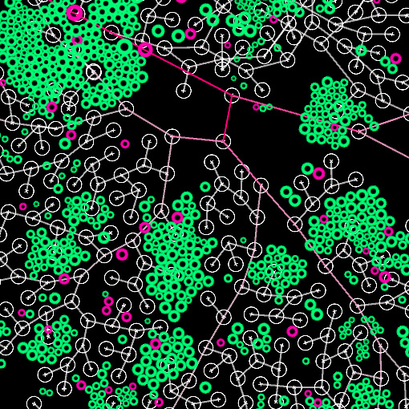

# The Codex

_FR:_ 

Ce repo est régulièrement mis à jour. Vous y trouverez mes exemples de fonctions liées à des concepts mathématiques écrits en javascript.

_EN:_

This repository is regularly updated. You will find my examples of functions related to mathematical concepts written in javascript.  

## Thèmes
  * **Arrays** - _Manipulation de tableaux_
  
    * [isolerElements.js](/Arrays/isolerElements.js)
    * [sousTableaux.js](/Arrays/sousTableaux.js)
      

  * **Bits** - _Manipulation de bits_
  
    * [divisionParDeux.js](/Bits/divisionParDeux.js)
    * [multiplicationParDeux.js](/Bits/multiplicationParDeux.js)
    * [estPair.js](/Bits/estPair.js)
    * [estPositif.js](/Bits/estPositif.js)
    * [getbit.js](/Bits/getbit.js)
    * [longueurBit.js](/Bits/longueurBit.js)
    * [puissanceDeDeux.js](/Bits/puissanceDeDeux.js)
    * [entierEnBinaire.js](Bits/entierEnBinaire.js)
    * [inverserBinaire.js](Bits/inverserBinaire.js)
    * [sommeConsecutive.js](/Bits/sommeConsecutive.js)
    * [permutationXOR.js](/Bits/permutationXOR.js)
    * [chiffrementXOR.js](/Bits/chiffrementXOR.js)
      
    
  * **Maths** - _Algorithmique, combinatoire, ..._
  
    * [factorielle.js](/Maths/factorielle.js)
    * [fibonacci.js](/Maths/fibonacci.js)
    * [nPuissanceN.js](/Maths/nPuissanceN.js)
      
  ---

